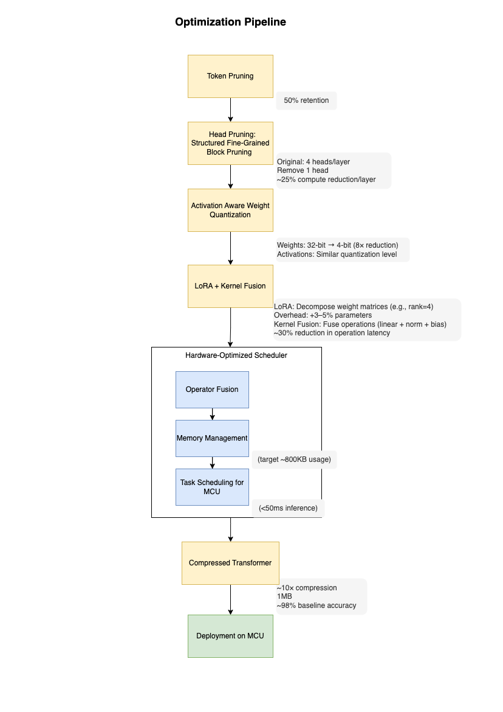

# Hybird Transformer-Compression

Transformer models have demonstrated state-of-the-art performance across various tasks, yet their high computational and memory demands hinder deployment on resource-constrained microcontroller units (MCUs). In this work, we propose a hardware-aware compression pipeline that enables 10× model size reduction while maintaining ~98% baseline accuracy, facilitating real-time deployment on sub-1MB SRAM devices. Our method integrates structured pruning reducing FLOPs by 50–60%, Activation-Aware Weight Quantization for 8x reduction in memory, with LoRA and kernel fusion, along with meta-scheduling for real-time inference execution.

We evaluate our approach on TinyBERT and TinySpeech benchmarks for keyword spotting and NLP inference, demonstrating a 10× compression, sub-1MB model size, and latency improvements of up to 50% on Cortex-M MCUs. Our results indicate that hardware-aware transformer compression enables the deployment of deep learning models on ultra-low-power embedded systems without significant accuracy degradation.

